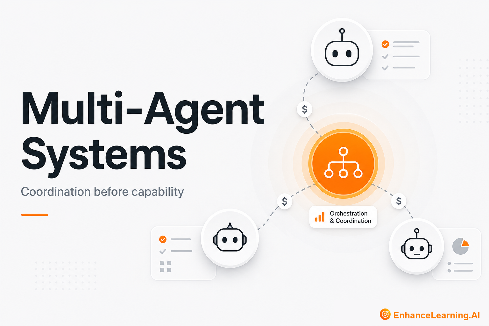

  

# Multi-Agent Systems: Coordination Costs Before Capability Gains

> Maintained reading path from [EnhanceLearning.AI](https://enhancelearning.ai) — practitioner-grade articles for engineers, architects, and technology leaders building production AI-native systems.

**Topic on the site:** [Multi-Agent Systems](https://enhancelearning.ai/articles?category=Multi-Agent+Systems) · **Full library:** [enhancelearning.ai/articles](https://enhancelearning.ai/articles)

## What this repo is

A curated reading path for **Multi-Agent Systems**. It is not a code SDK — it points to the foundation deep-dives on [EnhanceLearning.AI](https://enhancelearning.ai) so you can align on concepts, critique designs, and ship production systems that hold up.

These articles compare single-agent vs multi-agent architectures, orchestration vs collaboration, and how multi-agent designs differ from traditional distributed systems.

## Who it's for

Architects evaluating whether to split work across agents — and how to do it without creating an ops nightmare.

## Foundation articles

- [Single-Agent vs Multi-Agent Architectures](https://enhancelearning.ai/articles/single-agent-vs-multi-agent-architectures) — When multi-agent systems pay off—and when one bounded agent with good tools is the better production architecture.
- [The Difference Between Agent Orchestration and Agent Collaboration](https://enhancelearning.ai/articles/difference-between-agent-orchestration-and-agent-collaboration) — Orchestration and collaboration are not interchangeable multi-agent patterns. Learn when to centralize control and when peers should negotiate.
- [The Coordination Problem: Why More AI Agents Doesn't Mean More Capability](https://enhancelearning.ai/articles/the-coordination-problem-why-more-ai-agents-doesnt-mean-more-capability) — Adding agents increases coordination overhead faster than capability. Design explicit coordination or accept diminishing returns.
- [Multi-Agent AI Systems vs Classical Distributed Systems](https://enhancelearning.ai/articles/multi-agent-ai-systems-vs-classical-distributed-systems) — Multi-agent AI overlaps with distributed systems but is not the same. Import idempotency and tracing; do not treat LLM handoffs like RPC.

## More from EnhanceLearning.AI

- Homepage: [https://enhancelearning.ai](https://enhancelearning.ai)
- All articles: [https://enhancelearning.ai/articles](https://enhancelearning.ai/articles)
- This topic filter: [Multi-Agent Systems](https://enhancelearning.ai/articles?category=Multi-Agent+Systems)
